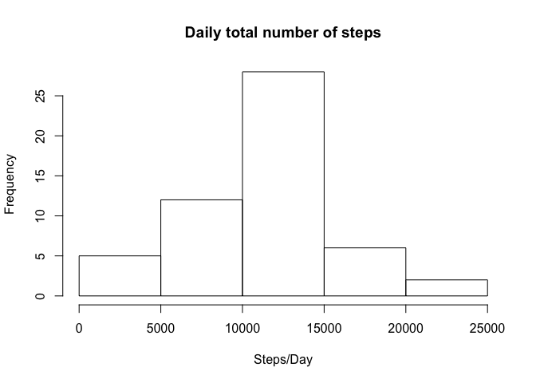
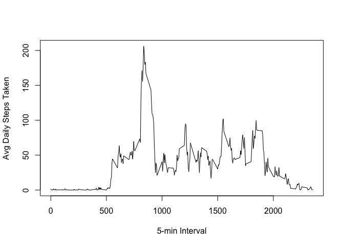
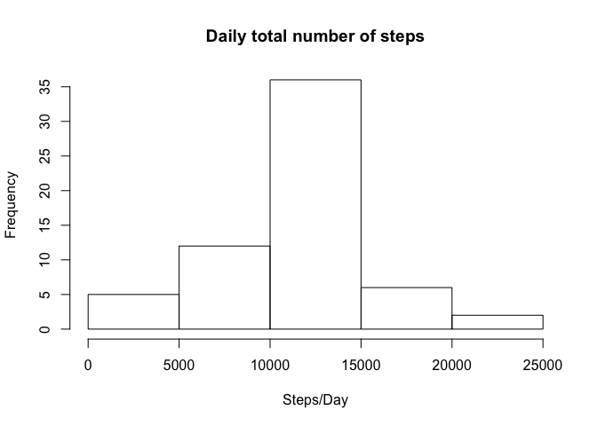
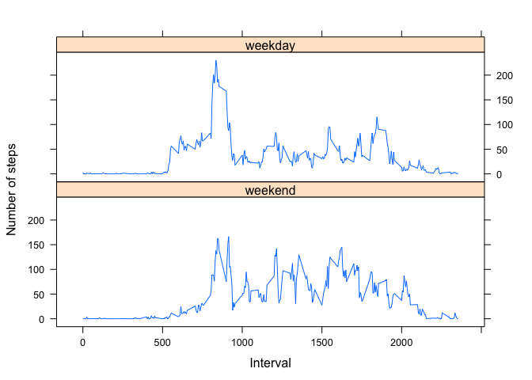

# Reproducible Research: Peer Assessment 1


## Loading and preprocessing the data

```r
library(data.table)
activityData <- fread(unzip("activity.zip"))
```

## What is mean total number of steps taken per day?
### Calculate the total number of steps taken per day

```r
library(dplyr)
dailyData <- activityData %>% group_by(date) %>% summarise(dailySteps = sum(steps))
print(dailyData)
```

```
## Source: local data table [61 x 2]
## 
##          date dailySteps
##         (chr)      (int)
## 1  2012-10-01         NA
## 2  2012-10-02        126
## 3  2012-10-03      11352
## 4  2012-10-04      12116
## 5  2012-10-05      13294
## 6  2012-10-06      15420
## 7  2012-10-07      11015
## 8  2012-10-08         NA
## 9  2012-10-09      12811
## 10 2012-10-10       9900
## ..        ...        ...
```
### Histogram of the total number of steps taken each day

```r
hist(dailyData$dailySteps,xlab = "Steps/Day", main = "Daily total number of steps")
```

 

### Calculate and report the mean and median of the total number of steps taken per day

```r
meanDailyStep <- dailyData %>% summarize(mean(dailySteps,na.rm = TRUE))
medianDailyStep <- dailyData %>% summarize(median(dailySteps,na.rm = TRUE))
print(meanDailyStep)
```

```
## Source: local data table [1 x 1]
## 
##   mean(dailySteps, na.rm = TRUE)
##                            (dbl)
## 1                       10766.19
```

```r
print(medianDailyStep)
```

```
## Source: local data table [1 x 1]
## 
##   median(dailySteps, na.rm = TRUE)
##                              (int)
## 1                            10765
```
## What is the average daily activity pattern?
### Make a time series plot

```r
intervalData <- activityData %>% group_by(interval) %>% summarise(steps=mean(steps,na.rm=TRUE))
plot(intervalData$interval,intervalData$steps,type = "l",xlab = "5-min Interval",ylab = "Avg Daily Steps Taken")
```

 

### Which 5-minute interval contains the maximum number of steps?

```r
intervalData[steps == max(intervalData$steps)]
```

```
## Source: local data table [1 x 2]
## 
##   interval    steps
##      (int)    (dbl)
## 1      835 206.1698
```

## Imputing missing values
### Calculate and report the total number of missing values in the dataset

```r
sum(is.na(activityData$steps))
```

```
## [1] 2304
```
### Fill in all of the missing values in the dataset.
  Missing data will be filled with the average number of steps in the same 5 minute interval across the entire dataset for the interval with the NA steps.

### Create a new dataset that is equal to the original dataset but with the missing data filled in

```r
activityData$steps <- as.double(activityData$steps)
newActivityData <- activityData %>% group_by(interval) %>% mutate(steps = replace(steps,is.na(steps), mean(steps,na.rm = TRUE)))
```
### Make a histogram of the total number of steps taken each day 

```r
newDailyData <- newActivityData %>% group_by(date) %>% summarise(dailySteps = sum(steps))
hist(newDailyData$dailySteps,xlab = "Steps/Day", main = "Daily total number of steps")
```

 

```r
meannewDailyStep <- newDailyData %>% summarize(mean(dailySteps))
mediannewDailyStep <- newDailyData %>% summarize(median(dailySteps))
print(meannewDailyStep)
```

```
## Source: local data table [1 x 1]
## 
##   mean(dailySteps)
##              (dbl)
## 1         10766.19
```

```r
print(mediannewDailyStep)
```

```
## Source: local data table [1 x 1]
## 
##   median(dailySteps)
##                (dbl)
## 1           10766.19
```

## Are there differences in activity patterns between weekdays and weekends?
### Create a new factor variable in the dataset with two levels – “weekday” and “weekend” 


```r
library(lattice)
weekend <- c("Sunday","Saturday")
groupedData <- newActivityData %>% mutate(isWeekend = factor((weekdays(as.Date(date)) %in% weekend),levels = c("TRUE","FALSE"),labels = c("weekend","weekday")))
```
### Make a panel plot containing a time series plot

```r
intervalGrpData <- groupedData %>% group_by(interval,isWeekend) %>% summarise(steps=mean(steps,na.rm=TRUE))
xyplot(steps ~interval | isWeekend, intervalGrpData, type = "l",ylab="Number of steps",xlab = "Interval", layout=c(1,2))
```

 

